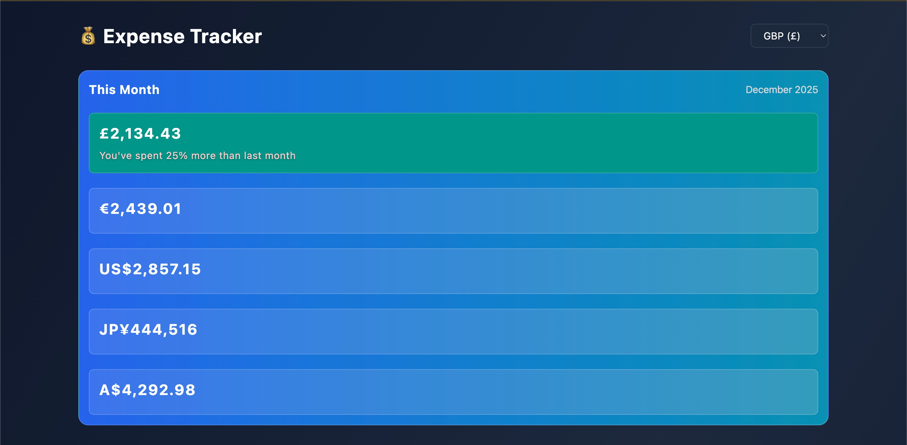
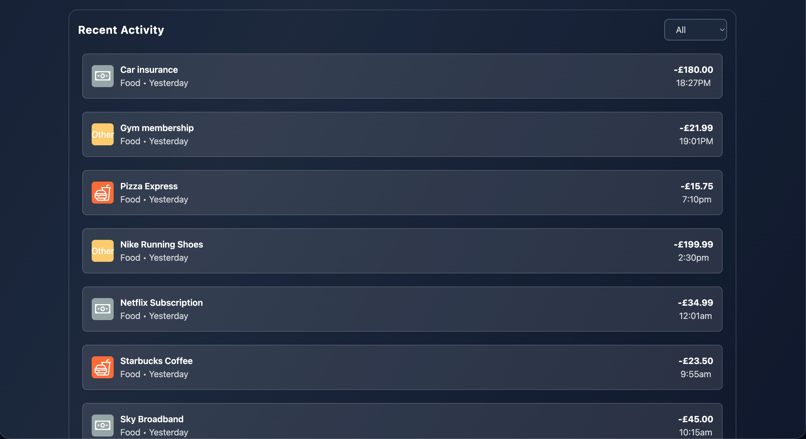

# Expense Tracker

A modern, basic expense tracking application built with React and Redux Toolkit. Track your spending across multiple categories, view monthly breakdowns, and monitor your expenses in different currencies with realtime currency convertion.

## Features

- **Monthly Overview**: View total spending for the current month with percentage change comparison
- **Category Breakdown**: Track expenses across five categories (Food, Travel, Bills, Housing, Other)
- **Quick Add**: Rapidly add new expenses with an intuitive form interface
- **Recent Activity**: Monitor your latest transactions with filtering capabilities
- **Multi-Currency Support**: View your expenses in GBP, EUR, USD, JPY, or AUD
- **Real-time Updates**: Instant UI updates when adding new expenses

## Tech Stack

- **Frontend**: React
- **State Management**: Redux Toolkit
- **Styling**: Tailwind CSS
- **API**: JSON Server (mock backend)
- **Build Tool**: Vite

## Project Structure

## Getting Started

### Prerequisites

- Node.js (v16 or higher)
- npm or yarn

### Installation

1. Clone the repository:

```bash
git clone https://github.com/A-Karim2003/Expense-Tracker.git
cd expense-tracker
```

2. Install dependencies:

```bash
npm install
```

3. Start the JSON Server (mock backend):

```bash
npx json-server --watch db.json --port 9000
```

4. In a new terminal, start the development server:

```bash
npm run dev
```

5. Open your browser and navigate to `http://localhost:5173`

## Usage

### Adding an Expense

1. Navigate to the "Quick Add" section
2. Enter the amount (e.g., 25.50)
3. Add a description (optional but recommended)
4. Select a category by clicking one of the category icons
5. Click "Add Expense"

### Viewing Expenses

- **This Month**: See your total spending with currency conversions
- **Breakdown**: View spending by category with month-over-month comparison
- **Recent Activity**: Filter and browse your latest transactions

### Changing Currency

The app displays your expenses in multiple currencies simultaneously in the "This Month" section, with your default currency highlighted.




